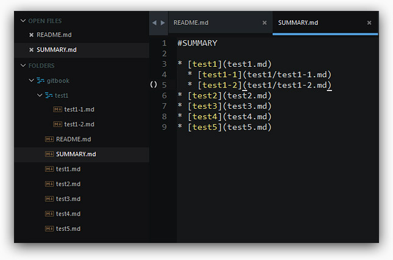

首先我們必須要先安裝 Node.js，請到 Node.js 的網站下載安裝，安裝之後基本上就會連同 Node.js 的 npm 一起安裝完成。\( [http:\/\/nodejs.org\/](http://nodejs.org/) \)

接著就是打開 cmd \( windows \) 或 terminal \( Mac \)，安裝 gitbook，安裝的方法就是直接輸入下列命令，就可以將 gitbook 安裝到全域。

npm install gitbook -g

安裝完成之後，同樣利用指令來到我們要編輯 GitBook 的資料夾，就可以來用我們自己慣用的編輯器撰寫 Markdown 囉！不過在撰寫之前有一個很重要的，就是要先新增 README.md 和 SUMMARY.md 這兩個檔案，新增完成之後，輸入下方指令，GitBook 就會進行初始化，也就是會按照 SUMMARY.md 的內容，把檔案與資料夾配置好。

gitbook init

接著就是要新增一個名為 book.json 的檔案，我們可以將一些 plugin 寫在裡頭，如此一來我們就可以在 GitBook 裡頭，使用 Google Analytics \( Google 分析 \)、Disqus \( 社群&留言板 \) 和 youtube ...等外掛，同時你也可以從 npm 的網站，自行尋找需要的 [Gitbook plugin](https://www.npmjs.com/search?q=gitbook-plugin)。

book.json

{

 "plugins": \["disqus"\],

 "pluginsConfig": {

 "disqus": {

 "shortName": "你的留言板名稱"

 }

 }

}

