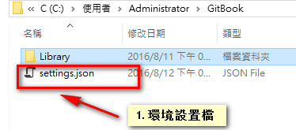
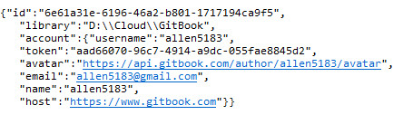

執行

環境設定檔:





在使用指令 "gitbook init" 創建 Gitbook 書本之前，必需要先建立 SUMMARY.md 及 README.md 兩個檔案，如果有自行設定 book.json 檔案，則也會在建立時一併讀取內容

* SUMMARY.md

  書本的目錄結構，其架構大致如下

  ```
  # Cowman 筆記
  將筆記整理於此，提供線上快速查詢
  * [第一層目錄](source/gitbook/first.md)
    * [第二層目錄](source/gitbook/second.md)
      * [第三層目錄](source/gitbook/third.md)
  * [第一層目錄](source/gitbook/first1.md)

  ```

  注意 另外因為預設只會創建第二層以內的檔案目錄及檔案，修正方式可以參考另一個章節 [Gitbook 超過兩層目錄結構](https://cowmanchiang.me/gitbook/gitbook/contents/parse.html)


* README.md

  書本的簡介

  ```
  # Cowman 筆記
  使用Gitbook服務記錄一些日常的筆記

  ```

  內容會出現在 Introduction 的章節中


* book.json

  設定書本的屬性，包含需使用哪些外掛等資訊就需要在 book.json 中說明，其檔案結構如下


```
  {
    // Folders to use for output
    // Caution: it overrides the value from the command line
    // It's not advised this option in the book.json
    "output": null,

    // Generator to use for building
    // Caution: it overrides the value from the command line
    // It's not advised this option in the book.json
    "generator": "site",

    // Book metadats (somes are extracted from the README by default)
    "title": null,
    "description": null,
    "isbn": null,

    // For ebook format, the extension to use for generation (default is detected from output extension)
    // "epub", "pdf", "mobi"
    // Caution: it overrides the value from the command line
    // It's not advised this option in the book.json
    // 這邊會強制後續在輸出電子書時所使用的格式，建議留空
    "extension": null,

    // Plugins list, can contain "-name" for removing default plugins
    "plugins": [],

    // Global configuration for plugins
    "pluginsConfig": {
        "fontSettings": {
            "theme": "sepia", "night" or "white",
            "family": "serif" or "sans",
            "size": 1 to 4
        }
    },

    // Variables for templating
    "variables": {},

    // Links in template (null: default, false: remove, string: new value)
    "links": {
        // Custom links at top of sidebar
        "sidebar": {
            "Custom link name": "https://customlink.com"
        },

        // Sharing links
        "sharing": {
            "google": null,
            "facebook": null,
            "twitter": null,
            "weibo": null,
            "all": null
        }
    },


    // Options for PDF generation
    "pdf": {
        // Add page numbers to the bottom of every page
        "pageNumbers": false,

        // Font size for the fiel content
        "fontSize": 12,

        // Paper size for the pdf
        // Choices are [u’a0’, u’a1’, u’a2’, u’a3’, u’a4’, u’a5’, u’a6’, u’b0’, u’b1’, u’b2’, u’b3’, u’b4’, u’b5’, u’b6’, u’legal’, u’letter’]
        "paperSize": "a4",

        // Margin (in pts)
        // Note: 72 pts equals 1 inch
        "margin": {
            "right": 62,
            "left": 62,
            "top": 36,
            "bottom": 36
        },

        //Header HTML template. Available variables: _PAGENUM_, _TITLE_, _AUTHOR_ and _SECTION_.
        "headerTemplate": null,

        //Footer HTML template. Available variables: _PAGENUM_, _TITLE_, _AUTHOR_ and _SECTION_.
        "footerTemplate": null
    }
  }
```

當編輯完 SUMMARY.md、README.md 及 book.json \(可以忽略\) 後使用指令 gitbook init 便會根據前列檔案內容產生書本的各章節檔案，此時在針對各章節檔案 \(\*.md\) 進行編輯即可 


