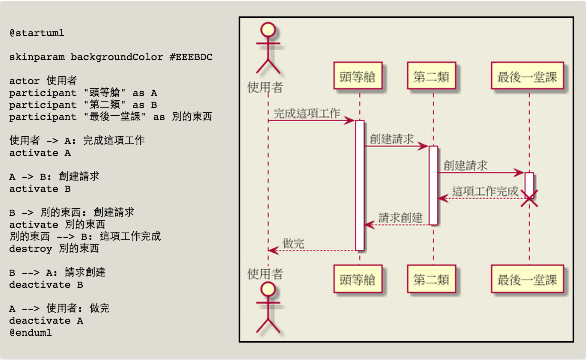
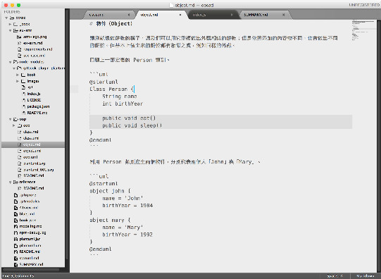
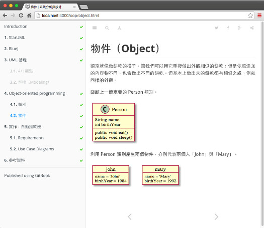

GitBook PlantUml Plugin

---

利用 GitBook Plugin 的擴充，讓 GitBook 對寫作與內容發行能有更多應用方式；例如官方提供的 Science 範本，就是搭配 mathjax 套件，自動處理 Markdown 內容中的數學式。

如果使用 GitBook 寫作教材時，需要提供簡單的 UML 塑模圖形；這時候若搭配 UML 繪圖工具，就會讓修改變得麻煩，無法一次在 Markdown 中處理完畢；每次需要修改圖形時，都必須另外打開 UML 繪圖工具，改完再重新匯出圖片檔，這樣相當麻煩。

PlantUML 是搭配 graphviz 繪製 UML 圖形的 Java Library，在原始碼我們可以用純文字方式描述 UML 模型，交給 PlantUML 轉換成 UML 圖形。

整合 PlantUML 到 GitBook 的方式，就是建立一個 GitBook PlantUML Plugin 套件。

GitBook PluginUML Plugin — https:\/\/github.com\/lyhcode\/gitbook-plugin-plantuml

1. {

2. "plugins": \[ "plantuml" \]

3. }

  這是一段取自 PlantUML 官方網站的範例，左邊的 @startuml … @enduml 就是用來描述 UML 模型的純文字代碼。

  

在 Markdown 原始碼中，使用程式碼區塊（code block）來保存一段 PlantUML 代碼。

1. \`\`\`uml

2. @startuml

3. Animal &lt;\|-- Dog

4. Animal &lt;\|-- Cat

5. @enduml

6. \`\`\`

搭配 PlantUML Plugin 就能自動從 Markdown 內容產生所需要的 UML 圖片，且過程只需要簡單的 Node.js 程式即可處理完成。

直接修改 Markdown 內容中的 UML 描述文字，儲存後就可以在瀏覽器看到修改結果，教材編寫效率因此提高不少。

